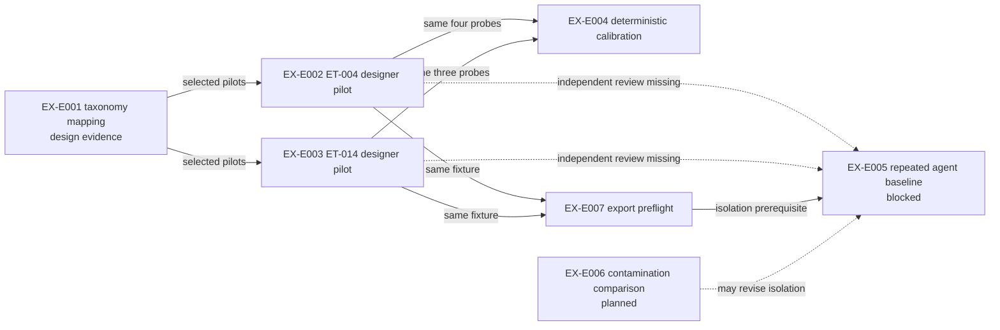

# Non-Human Experimental Lineage and Dependency Map

## Relationship classifications

| Parent | Descendant | Relationship | Shared dependencies | Independence judgment |
|---|---|---|---|---|
| EX-E001 | EX-E002 | Follow-up, task-family instantiation | Same repository interpretation and researcher | Not an independent replication |
| EX-E001 | EX-E003 | Follow-up, task-family instantiation | Same repository interpretation and researcher | Not an independent replication |
| EX-E002 | EX-E004 | Shared-data and shared-evaluator dependency | Four probes, expected labels, task, researcher | Calibration reuses evidence; no new independent outcome sample |
| EX-E003 | EX-E004 | Shared-data and shared-evaluator dependency | Three probes, expected labels, task, researcher | Calibration reuses evidence; no new independent outcome sample |
| EX-E002 | EX-E007 | Extension/preflight | Same ET-004 source fixture and exporter | New property measured, but not independent support for task validity |
| EX-E003 | EX-E007 | Extension/preflight | Same ET-014 source fixture and exporter | New property measured, but not independent support for task validity |
| EX-E002/003/007 | EX-E005 | Prerequisites | Tasks and exporter will be reused | Future runs can add independent stochastic attempts, not independent task sampling |

## Replication matrix

| Original experiment | Replication | Independence | Result | Replication strength |
|---|---|---|---|---|
| EX-E002 | None | — | — | None |
| EX-E003 | None | — | — | — |
| EX-E004 | 2026-07-30 local rerun of `evalctl.py all` | Same code, same probes, same labels, later environment | 7/7 again | Regression reproduction only; weak scientific replication |
| EX-E007 | No retained independent repeat | — | — | None |

There are zero direct, conceptual, or independent replications of a scientific
finding. Different probe filenames are not independent experiments. The
effective independent sample for grader generalization is zero because all
seven cases were authored alongside the evaluator.

## Inflated-count warning

The defensible counts are:

- two distinct task contracts;
- seven purposive probe artifacts;
- one deterministic classification mechanism;
- one recorded calibration execution, plus a same-artifact reproducibility run;
- two export instances through one exporter.

“Seven successful experiments,” “four replications,” or “two validated tasks”
would each be false.
